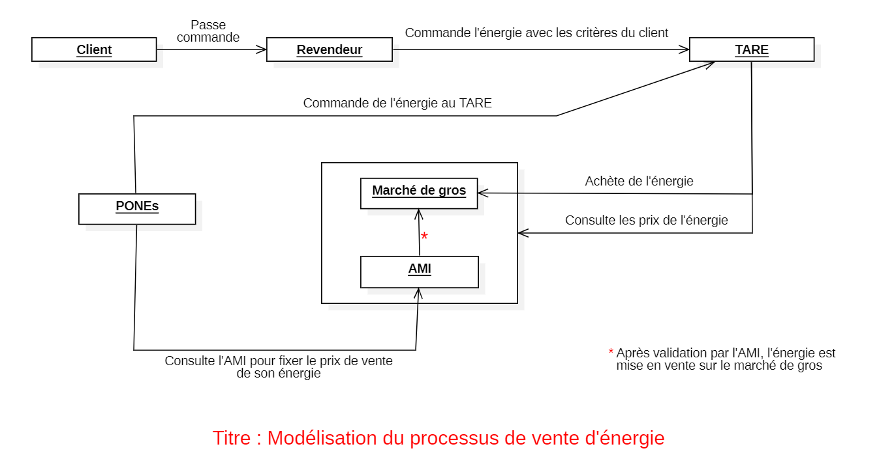

# Scrum

Projet : Système d'achat d'énergie

# Modélisation du projet

# 1. Les backlogs
1. Edition du rapport 
2. Application web - Serveur PHP
3. Serveur HTTP - JAVA
4. Serveur UDP - JAVA
5. Serveur TCP - JAVA
6. Chiffrement 
7. Mise en oeuvre SALE

# 2. Les stories
<b><u>1. Edition du rapport :</u></b>  
   <ul>
        <li>1.1 Page de garde  </li>
        <li>1.2 Sommaire  </li>
        <li>1.3 Schéma global détaillant toutes les entités présente et les technologies de communication associés entre elles.  </li>
        <li>1.4 Pour chaque couple d'entités pouvant communiquer entre elles, il faudra indiquer : </li>
        <ul>
            <li>
                le format des messages échangés et la justification de ce format
            </li>    
            <li>
                la liste des requêtes associés
            </li>
            <li>
                le détail d'un de ces échanger pour illustrer le fonctionnement (potentiellement mettre un chronogramme si on l'a vu en TD)
            </li>
        </ul>
        <li>1.5 Pour les scénarios suivant, établir les échanges complets qui ont lieu entre les entités concernées :   </li>
            Scénario : voir le fichier <a href="Sujet.pdf">Sujet.pdf</a>
        <li>1.6 Explication des différents choix d'implémentation</li>
   </ul>
    
<b><u>2. Application web - serveur PHP </u></b>
    <ul>
        <li>2.1 Utilisation d'un serveur PHP unique, qui sera utilisé par le site du revendeur</li>
        <li>2.2 Utilisateur peut consulter les énergies disponibles</li>
        <li>2.3 Utilisateur préparer/commander sa commande</li>
        <li>2.4 Utilisateur peut consulter son historique de commande</li>
        <li>2.5 Etat d'avancement de sa commande (BONUS)</li>
    </ul>

<b><u>3. Serveur HTTP - JAVA</u></b> 
Le serveur HTTP représente un TARE
    <ul>
        <li>3.1 Chaque TARE présent dans le système en possède</li>
        <li>3.2 Toute requête du revendeur nécessitant d'interoger un TARE partira du site PHP vers le serveur HTTP concerné</li>
    </ul>

<b><u>4. Serveur UDP - JAVA</u></b> 
Le serveur UDP représente le marché de gros
    <ul>
        <li>4.1 Réponse du marché de gros aux requêtes des TARE</li>
            <ul>
                <li>4.1.1 Demande d'information sur les énergies</li>
                <li>4.1.2 Achat d'un lot d'énergie</li>
            </ul>
        <li>4.2 Recevoir les envoies de lots d'énergie en provenance des PONEs</li>
    </ul>

<b><u>5. Serveur TCP - JAVA</u></b> 
Le serveur TCP représente l'AMI
    <ul>
        <li>5.1 Vérifie que tout se passe bien sur le marché de gros</li>
        <li>Le marché de gros est le client du serveur AMI et communique avec celui-ci pour faire valider les prix de vente des lots d'énergie proposés par les PONES</li>
        <li>Valider les ventes faites avec des TAREs</li>
    </ul>

<b><u>6. Chiffrement</u></b> 
    <ul>
        <li>Tout lot d'énergie se verra accompagné d'un certificat établit par l'AMI lors de la vente (avec un chiffrement asymétrique)</li>
        <li>Toute entité voulant discuter avec l'AMI, dont le marché de gros, devra chiffrer symétriquement ses communications (clé générée aléatoirement au démarrage du système concerné</li>
    </ul>

<b><u>7. Mise en oeuvre SALE</u></b> 
    <ul>
        <li>7.1 Tout doit fonctionner au sein d'un même terminal</li>
        <li>7.2 Utilisation des Threads, qui s'occuperont de lancer les serveurs</li>
        <li>7.3 Possibilité d'apporté des modifications au système pendant son fonctionnement</li>
        <li>7.4 Affichage : </li>

            [PONE]: J'ai fourni le lot d'énergie suivant (ici détail du lot). 
            [Marche de Gros] : J'ai reçu le lot d'énergie (ici même détail du lot).
    
<li>7.5 Etablir des fichiers de configuration</li>
</ul>

### Liens du suivi du projet : 
- https://trello.com/b/jjI6d807/projet-info0503 